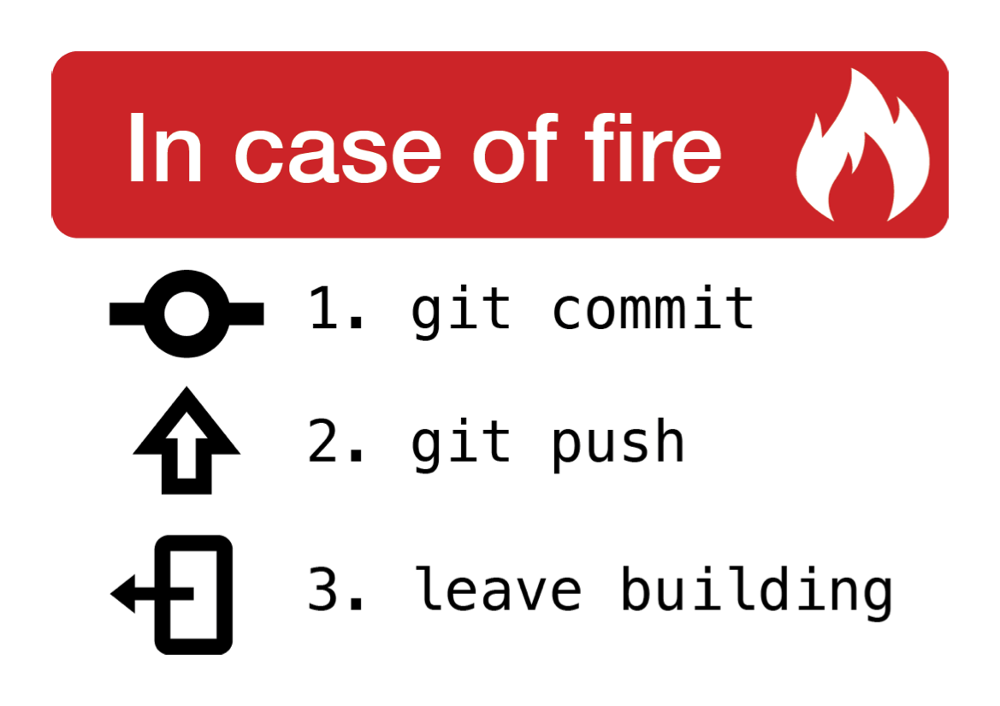

# Git & Github course


This is the material for the URFIST course on Git & GitHub.  
Bordeaux, March 27 & 28, 2018.  

**Table of Content**

- [Building our own versioning system](#building-our-own-versioning-system)
    - [Setup](#setup)
    - [Taking snapshots](#taking-snapshots)
    - [A better naming scheme](#a-better-naming-scheme)
    - [Keeping logs](#keeping-logs)
    - [Selective saving](#selective-saving)
    - [Incremental savings](#incremental-savings)
    - [Alternative ending](#alternative-ending)
- [Git to the rescue](#git-to-the-rescue)
- [Interactive Git](#interactive-git)
- [Collaborative book on GitHub](#collaborative-book-on-github)
    - [Creating an account](#creating-an-account)
    - [Forking the original project](#forking-the-original-project)
    - [Adding remote](#adding-remote)
    - [Modifying content](#modifying-content)
    - [Making a Pull request](#making-a-pull-request)
    - [Rebasing your branch](#rebasing-your-branch)
    - [Merging changes](#merging-changes)
- [External Resources](#external-resources)


## Building our own versioning system

* **Goal**:       To build our own versioning system using system tools
* **Duration**:   3h
* **Public**:     Novice
* **Difficulty**: ★☆☆


### Setup

Let us imagine we've decided to write a book. This book will be composed of an
introduction, three chapters and a conclusion. We could decide to use a word
processor (e.g. [Open Office](http://www.openoffice.org/?redirect=soft)) to write it, but for the sake of this course,
we'll use instead a light markup format ([markdown](https://github.com/adam-p/markdown-here/wiki/Markdown-Cheatsheet)) such that we won't have
to deal with style nor layout (you'll see that we can do it later using
[pandoc](https://pandoc.org)). At this point, we only have to decide how we'll organize
ourselves. Either we create a single file that will ultimately contains the
whole book, or we can also use a logical split into the five different parts
(introduction, 3 chapters and conclusion). Let's start with the second solution
using the [touch](https://man.cx/touch) command to create empty files. Open a terminal and type:

``` bash
$ mkdir book
$ cd book
$ touch introduction.txt
$ touch chapter-1.txt chapter-2.txt chapter-3.txt
$ touch conclusion.txt
```

You should obtain a `book` directory containing five files. You can now use
your preferred text editor (for example [Notepad++](https://notepad-plus-plus.org) (Windows only),
[Atom](https://atom.io), [Emacs](https://www.gnu.org/software/emacs/) or [Vim](https://www.vim.org)) to start writing the next best-seller...
Let's start with the introduction. Open the `introduction.txt`file and type a
few words.


### Taking snapshots

You've written a few lines already and you start to worry that you may have
erased some text that you think is not so good right now but might be worth to
be reconsidered some time later. If you do not have any backup, this erased
text is lost once and for all. Consequently, before erasing something, it might
be a good idea to save a snapshot of your current work. The question is how do
we do that? One obvious and simple solution is to make a copy of all your files
and to store them at some other place (e.g. in a `snapshots` directory). This
can be done very easily using the [cp](https://man.cx/cp) command (after having created the
`snapshots` directory):

``` bash
$ mkdir snapshots
$ mkdir snapshots/snapshot-1
$ cp *.txt snapshots/snapshot-1/
```

We're safe! We now have a full copy of our book. We can continue modifying it
and save as many snapshots as needed:

``` bash
$ mkdir snapshots/snapshot-2
$ cp *.txt snapshots/snapshot-2/
```


#### Exercise 

Start writing the introduction and save a snapshot then start writing the first
chapter and save another snapshot. 

* How do you decide of the name of the next snapshot?
* What happens if you re-use an already existing snapshot name?
* How can you prevent to accidentaly overwrite a previous snapshot?


### A better naming scheme

After a few hours (or a few days), and depending on the frequency of your
snapshots, you'll end up with a `snapshots` directory holding several copies of
your work at different time, the oldest being `snapshot-1`. At that point, we
can see we have a problem. For example, we don't know if `snapshots/snapshot-5`
refers to a version from a few hours ago or from a few days ago. The
incremental naming scheme we've been using so far is not really informative and
this is not the best one we could have chosen. We can use instead the current
date and time for the snapshot filename. Not only we won't have to keep track
of the number of snapshots anymore but the name of the snapshots will be
indicative of when have they have been created. To do that, we can use the
[date](http://man7.org/linux/man-pages/man1/date.1.html) function.

``` bash
$ name=snapshot-`date '+%Y-%M-%d-%Hh%M'`
$ mkdir snapshots/$name
$ cp *.txt snapshots/$name
```

We can further simplify things by creating a simple [bash](https://www.gnu.org/software/bash/) script that will
take care of everything. We'll name it `commit.sh`:

``` bash
#!/bin/bash
# commit.sh, version 1

# Name of the snapshot
name=snapshot-`date '+%Y-%M-%d-%Hh%M'`

# Creation of the snapshot directory
mkdir snapshots/$name

# Actual saving of the file from the stage directory
cp *.txt snapshots/$name

# Message
echo "Saving snapshot $name"
```

You may have to change the rights on the file such that it becomes executable:

``` shell
$ chmod 755 commit.sh
```

Now, each time we need to create a snapshot, we just have to call this script.

#### Exercise

Try to change the name of the snapshot such as to remove the time. What does it
imply for snapshots? How many different snapshots can you take a day now?


    
### Keeping logs

We now have a script to make a new snapshot whenever we want and we also keep
track of the time when a snapshot has been created (stored in the filename).
However, we do not know why a specific snapshot has been taken. Imagine you
just finished the introduction in your book, and before going to sleep, you
want to save a snapshot and to have a way to know this specific snapshot
corresponds to end of the introduction. Adding a message to the filename is not
really possible anymore because it is now given an automatic name and in any
case, we could not write a long message. To keep track of what a given snapshot
corresponds to, we'll use of a log file, i.e. a file where messages will be
recorded alongside the name of the snapshot. This means that when we'll save a
snapshot, we'll have to give a message to be registered.  Our new `commit.sh`
script reads:

``` bash
#!/bin/bash
# commit.sh, version 2
 
# Name of the snapshot
name=snapshot-`date '+%Y-%M-%d-%Hh%M'`

# Creation of the snapshot directory
mkdir snapshots/$name

# Actual saving of the file from the stage directory
cp *.txt snapshots/$name

# Message
echo "Saving snapshot $name"

# Recording log message
echo "$name : $1" >> snapshots/log.txt
```

And we can use it with a command such as:

``` bash
$ ./snapshot.sh "Introduction finished!"
```

Here is the view on our `snaphots`directory

``` shell
$ cd snapshots
$ ls -al
total 8
drwxr-xr-x  4 rougier  staff  128 Mar 10 18:42 ./
drwxr-xr-x  9 rougier  staff  288 Mar 10 18:42 ../
-rw-r--r--  1 rougier  staff   50 Mar 10 18:42 log.txt
drwxr-xr-x  7 rougier  staff  224 Mar 10 18:42 snapshot-2018-03-10-18h42/
```

And you look at the `log.txt` file, you should have:

``` bash
$ cat snapshots/log.txt
snapshot-2018-42-10-18h42 : Introduction finished
```


#### Exercise

What happen if no message is given? How do you fix that?


### Selective saving

What we have created so far is a very basic versioning system, but this system
is far from being efficient. One problem is that each time we create a
snapshot, we copy all the files unconditionally, modified or not. This means
that each snapshot may contain a copy of the same unmodified file. For example,
in our case, each and every snapshot contains a full copy of the `conclusion.txt`
file even though we never modified it. To avoid unnecessary copy, we thus need
to manually select what needs to be actually saved in a snapshot. To do that,
we'll create a temporary directory named `stage` where we will copy the files we
want to save and we'll take a snapshot of this directory instead of copying all
the `.txt` files:

``` shell
$ mkdir snapshots/stage
```

And we need to modify our `commit.sh` script accordingly

``` bash
#!/bin/bash
# commit.sh, version 3
 
# Name of the snapshot
name=snapshot-`date '+%Y-%m-%d-%Hh%M'`

# Creation of the snapshot directory
mkdir snapshots/$name

# Actual saving of the file from the stage directory
cp snapshots/stage/* snapshots/$name

# Message
echo "Saving snapshot $name: $1"
echo "$name : $1" >> snapshots/log.txt

# Cleanup the stage directory
rm snapshots/stage/*
```

We can now select what we want to backup:

``` shell
$ cp introduction.txt stage/
$ cp chapter-1.txt stage/
$ ./commit.sh "Introduction extended"
```

And if we want to backup everything:

#### Exercise

How would you cancel the addition of a file to the stage area?


``` shell
$ cp *.txt stage/
$ ./commit.sh "New idea incorporated"
```


### Incremental savings

Our last solution, that make use of a temporary `stage` directory, is nice but
less than ideal because we may still backup a file that has not been modified
since last backup. Ideally, we want to have some finer control. This is where
the [diff](https://man.cx/diff) command comes handy. This unix command allows to compare two
files to know if they're different (and to know what and where are the
differences). Instead of manually copying the file to the `stage` directory,
we'll thus use an `add.sh` script that will check if a file really needs some
backup. If not, we just make a symbolic link to the last saved version.

But how do we know where is the last saved version? Of course, we can compare
all the dates from the different snapshots in order to find the most recent
one. But if we were to write a script for doing the same, it would a bit
painful (but it can be done). What we can do instead is to have a symbolic
snapshot that will point to the last snapshot taken. This way, we'll know
immediately where is the last snapshot. Let's name this symolic snapshot `HEAD`
and let's modify our `commit.sh` script using the [ln](https://man.cx/ln) command.

``` bash
#!/bin/bash
# commit.sh, version 4

# Name of the snapshot
name=snapshot-`date '+%Y-%m-%d-%Hh%M'`

# Creation of the snapshot directory
mkdir snapshots/$name

# Actual saving of the file from the stage directory
cp stage/* snapshots/$name

# Message
echo "Saving snapshot $name: $1"
echo "$name : $1" > snapshots/log.txt

# Cleanup the stage directory
rm stage/*

# Creation of the symbolic latest snapshot
ln -Fs $snapshots/$name snapshots/HEAD
```

Let's test it:

``` bash
$ cp introduction.txt stage/
$ commit.sh "Testing the HEAD directory"
$ cd snaphosts
$ ls
total 8
drwxr-xr-x  10 rougier  staff  320 Mar 12 10:50 ./
drwxr-xr-x  12 rougier  staff  384 Mar 12 10:50 ../
lrwxr-xr-x   1 rougier  staff   35 Mar 12 10:50 HEAD@ -> snapshot-2018-03-12-10h50
-rw-r--r--   1 rougier  staff  164 Mar 12 10:50 log.txt
drwxr-xr-x   3 rougier  staff   96 Mar 12 10:50 snapshot-2018-03-12-10h50/
drwxr-xr-x   7 rougier  staff  224 Mar 12 10:15 snapshot-2018-03-12-10h15/
drwxr-xr-x   7 rougier  staff  224 Mar 12 10:16 snapshot-2018-03-12-10h16/
drwxr-xr-x   7 rougier  staff  224 Mar 12 10:17 snapshot-2018-03-12-10h17/
drwxr-xr-x   7 rougier  staff  224 Mar 12 10:18 snapshot-2018-03-12-10h18/
drwxr-xr-x   2 rougier  staff   64 Mar 12 10:50 stage/
```

Now we can write a script `add.sh` that will add a file only if it differs from
the one in `HEAD`:


``` bash
#!/bin/bash
# add.sh, version 1

for file in "$@"
do
    if ! `diff -q $file snapshots/HEAD/$file`; then
        cp $file snapshots/stage/
    fi
done
```

We can use it with:

``` bash
$ ./add.sh *.txt
$ ./commit.sh "Adding modified files"
```

#### Exercise

What happens if you make two snapshots? Why an unmodified file is present in
the second snapshot? How to fix it?


### Alternative ending

Let's imagine now you have two ideas for the conclusion of your book. Ideally,
you would like to work on both versions but you have only one
`conclusion.txt`. How could we work on the same file in two different ways and
switch to one or the other at will? This is now a bit too complex for our
rudimentary versioning system and we need to use a real versioning tool such as
git.


## Git to the rescue

* **Goal**:       To discover git basic commands
* **Duration**:   3h
* **Public**:     Novice
* **Difficulty**: ★☆☆

We'll use the introduction to version control for novices using Git by
[Software Carpentry](https://software-carpentry.org).  
Please go to https://swcarpentry.github.io/git-novice/


## Interactive Git

* **Goal**:       To discover git advanced commands
* **Duration**:   3h
* **Public**:     Beginner
* **Difficulty**: ★★☆

We'll use the very nice [Learn Git Branching](https://learngitbranching.js.org) by Peter Cottle.


## Collaborative book on GitHub


* **Goal**:       To use GitHub for writing a collaborative book
* **Duration**:   3h
* **Public**:     Novice
* **Difficulty**: ★☆☆

See also [GitHub Guides](https://guides.github.com)


### Creating an account

First you need to create an account on [GitHub](https://github.com/). Choose your login wisely
since you'll see it a lot while interacting on GitHub. Once created, you can
browse around and search for interesting repositories or people. For each of
them, you can star them to bookmark them and receive notifications when
something is happening. You can also configure how you'll receive notifications
(online or by email). If you're using GitHub a lot, it might be a good thing to
disable email notifications.

### Forking the original project

You have to fork the repository https://github.com/rougier/URFIST-Book in your
GitHub account and then to clone your fork (i.e. not the original repository)
on your computer. What are is the current remote?

``` bash
$ git remote -v
origin	git@github.com:rougier/URFIST-Book.git (fetch)
origin	git@github.com:rougier/URFIST-Book.git (push)
```

### Adding remote

After you cloned the repository, you should have an `origin` remote that points
toward your GitHub repository. You need now to add a new remote named `upstream`
that points back to the original repository.

``` bash
$ git remote add upstream git@github.com:rougier/URFIST-Book.git
$ git remote -v
origin	git@github.com:rougier/URFIST-Book.git (fetch)
origin	git@github.com:rougier/URFIST-Book.git (push)
upstream	git@github.com:rougier/URFIST-Book.git (fetch)
upstream	git@github.com:rougier/URFIST-Book.git (push)
```

### Modifying content

Each group will need to write a chapter, however, to know which chapter you
have to write, you'll have to first open an issue on the original repository on
GitHub and ask what chapter you have to write. One you know the answer, you can
start creating the corrresponding file and commit locally your change. Then you
can push your change on GitHub. But where exactly do you need to push? `origin`
or `upstream`?

### Making a Pull request

After you've made your push, you can go to your repository on GitHub and click
at the newly proposed Pull Request button (relatively to your last commit).

### Rebasing your branch


### Merging changes


## External Resources

There exist a huge set of git resources online. You'll find below a selected
subset.


* [Learn Git Branching](https://learngitbranching.js.org) by Peter Cottle

  > Interested in learning Git? Well you've come to the right place! "Learn Git
  > Branching" is the most visual and interactive way to learn Git on the web;
  > you'll be challenged with exciting levels, given step-by-step
  > demonstrations of powerful features, and maybe even have a bit of fun along
  > the way.

* [Version Control with Git](http://swcarpentry.github.io/git-novice/) by Software Carpentry 

  > Version control is the lab notebook of the digital world: it’s what
  > professionals use to keep track of what they’ve done and to collaborate
  > with other people. Every large software development project relies on it,
  > and most programmers use it for their small jobs as well. And it isn’t just
  > for software: books, papers, small data sets, and anything that changes
  > over time or needs to be shared can and should be stored in a version
  > control system.

* [Pro Git Book](https://git-scm.com/book/en/v2) by Scott Chacon & Ben Straub
     
  > What is "version control", and why should you care? Version control is a
  > system that records changes to a file or set of files over time so that you
  > can recall specific versions later. For the examples in this book, you will
  > use software source code as the files being version controlled, though in
  > reality you can do this with nearly any type of file on a computer.

* [Git Cheat Sheet](https://www.git-tower.com/blog/git-cheat-sheet/) by Tobias Günther

  > Even with a GUI application at hand there are times when you resort to the
  > command line. We admit we can’t memorize all important Git commands –
  > that’s why we created a nice cheat sheet for Git that we would like to
  > share with you. On the front you can find all important commands. On the
  > back you can find our Version Control Best Practices that help you get the
  > most out of version control with Git.


* [Oh shit, git!](http://ohshitgit.com) by Katie Sylor-Miller

  > Git is hard: screwing up is easy, and figuring out how to fix your mistakes
  > is fucking impossible. Git documentation has this chicken and egg problem
  > where you can't search for how to get yourself out of a mess, unless you
  > already know the name of the thing you need to know about in order to fix
  > your problem.

* [Become a git guru](https://www.atlassian.com/git/tutorials)

  > Your mission is to learn the ropes of Git by completing the tutorial and
  > tracking down all your team's space stations.



